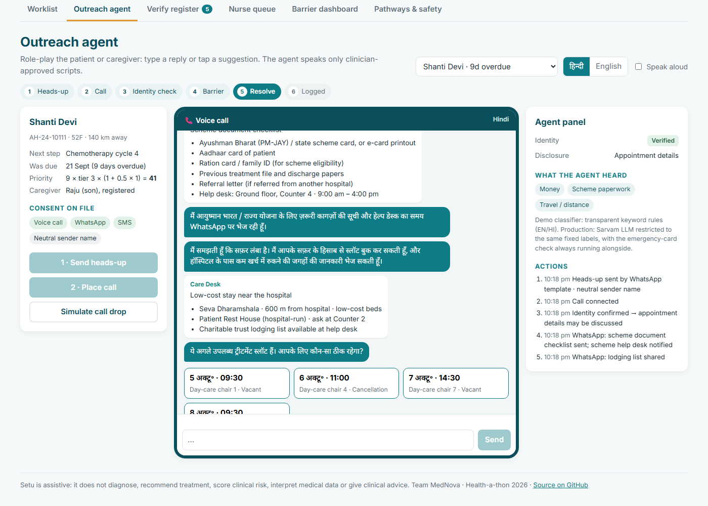
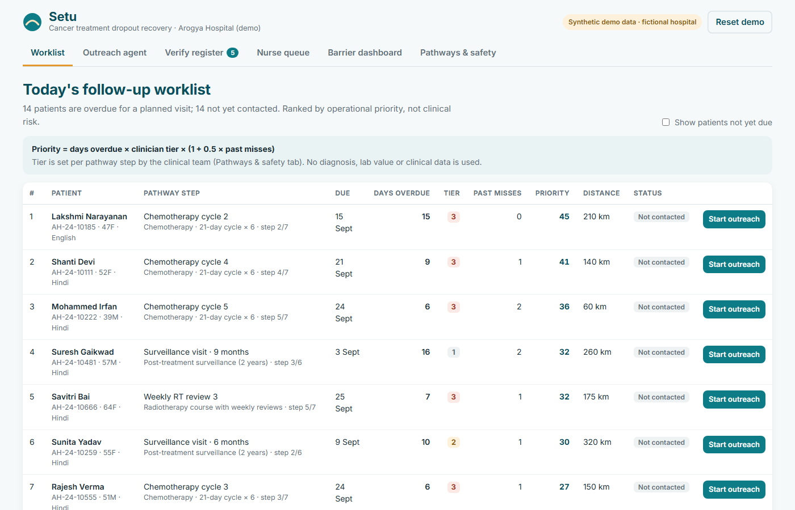
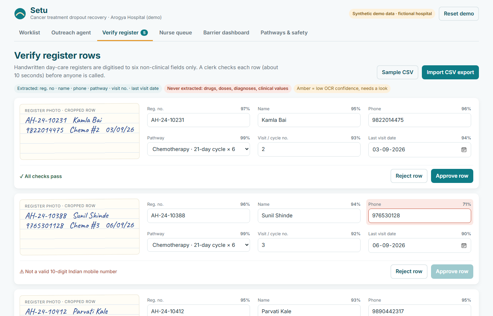
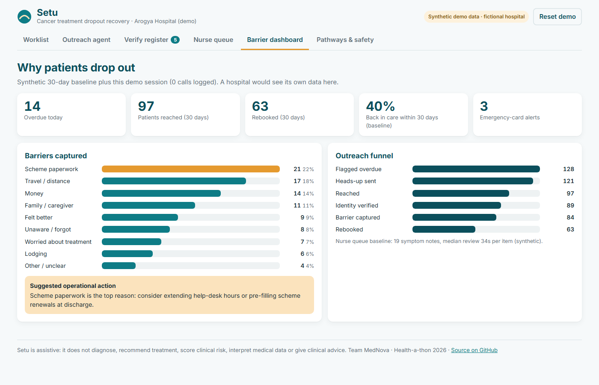
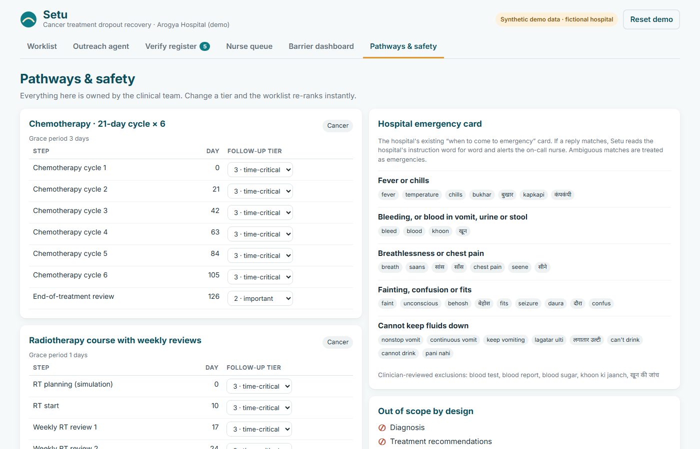
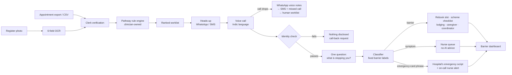

<div align="center">

# Setu
### Cancer Treatment Dropout Recovery

*Reminders don't bring patients back. Removing their barrier does.*

**[Live demo](https://hannielvinu.github.io/Setu/)** · Health-a-thon 2026 · Team MedNova

`Track: Cancer` · `Primary user: Doctor / Care Team` · `Use case: Patient Follow-up & Continuity of Care`

</div>



---

## Contents

- [The problem](#the-problem)
- [Our insight](#our-insight)
- [What Setu does](#what-setu-does)
- [Screens in the prototype](#screens-in-the-prototype)
- [How it works](#how-it-works)
- [Safety and scope by design](#safety-and-scope-by-design)
- [Try the demo in 2 minutes](#try-the-demo-in-2-minutes)
- [Prototype vs production](#prototype-vs-production)
- [Impact and 60–90 day pilot](#impact-and-6090-day-pilot)
- [Run locally](#run-locally)
- [Repository layout](#repository-layout)
- [Team](#team)
- [Evidence](#evidence)

---

## The problem

Cancer care is a chain of time-bound steps: chemotherapy cycles, radiotherapy and reviews, then years of surveillance. In India, patients quietly drop out between these steps.

| | |
|---|---|
| **34%** | of cervical cancer patients who completed treatment were lost to follow-up in a South Indian cohort (n=690); 12% did not complete planned treatment [1] |
| **19–50%** | treatment abandonment reported for paediatric AML across Indian centres [2] |
| **>100 km** | distance from the hospital: a consistently reported risk factor for loss to follow-up [1] |

Today, coordinators and patient navigators comb registers, spreadsheets and appointment lists by hand and cold-call patients one by one. It works, but it does not scale, and **the reason a patient left is rarely recorded**, so the cause is never fixed. Integrating with hospital software is expensive (about ₹30–50 lakh per mid-sized facility for ABDM-compliant integration [3]), so a solution that needs EMR integration will not reach most hospitals.

## Our insight

Many dropouts are driven by **non-clinical barriers**: scheme (PM-JAY / state) paperwork, travel and lodging costs, family and caregiver duties, "I feel better", fear of side effects, or not knowing the next date.

| Existing approach | Why it falls short |
|---|---|
| SMS reminders | Remind, but remove no barrier |
| Patient-initiated apps | Miss the silent patients who have already left |
| Human navigators | Effective, but one person cannot reach every patient |
| **Setu** | **Hospital-run outreach that finds silent dropouts, learns why in their language, removes the barrier and hands everything clinical to people** |

## What Setu does

A closed loop from *overdue* to *back in care*:

| Step | What happens | Who stays in control |
|---|---|---|
| **1 · Find** | Clinician-defined pathway templates and simple rules flag overdue patients from existing exports or clerk-verified register photos | Clinician sets pathways and tiers |
| **2 · Reach** | WhatsApp/SMS heads-up, then a consented voice call in the patient's language; WhatsApp voice-note, SMS and missed-call fallbacks | Patient consent on file |
| **3 · Understand** | Identity check, then one question: *what is stopping you from coming?* The AI only sorts the answer into a fixed list of non-clinical barriers | Fixed label set |
| **4 · Resolve** | Rebook a vacant slot, send the scheme document checklist, share lodging help, copy the caregiver, or hand over to a person | Deterministic rules and people |
| **5 · Measure** | Return-to-care tracking and a dashboard of *why* patients drop out | Hospital leadership |

## Screens in the prototype

| Follow-up worklist | Register verification |
|---|---|
|  |  |
| Overdue patients ranked by `days overdue × clinician tier × (1 + 0.5 × past misses)`. | Only six non-clinical fields are digitised. Short phone numbers, future dates and unreadable names block approval until a clerk fixes them. |

| Barrier dashboard | Pathways & safety |
|---|---|
|  |  |
| The hospital's first view of *why* patients leave, with a suggested operational fix. | Clinicians own pathways, tiers and the emergency card. Change a tier and the worklist re-ranks live. |

The **Outreach agent** (top of this page) runs the full call in Hindi or English, and the **Nurse queue** collects emergency-card matches and symptom mentions for a nurse to act on.

## How it works



**Technology**

| Layer | Choice |
|---|---|
| Voice and language | Sarvam AI speech-to-text, text-to-speech and LLM (Hindi + regional languages), restricted to the fixed barrier labels |
| Channels | Exotel voice calls and missed-call numbers, WhatsApp Business API (templates, Flows, voice notes), DLT-registered SMS |
| Core | FastAPI, PostgreSQL, JSON pathway rule engine, LangGraph agent orchestration |
| Interfaces | React: worklist, register verification, nurse queue, barrier dashboard |
| Data in | Excel/CSV exports or human-verified register photos. No EMR integration |
| Hosting | India-region, encrypted at rest and in transit, role-based access, audit log |

## Safety and scope by design

Setu does **not** diagnose, recommend treatment, provide clinical decision support, score clinical risk, interpret medical data or give clinical advice.

| Out-of-scope item | How Setu stays outside it |
|---|---|
| Diagnosis | Works only from schedule facts: pathway, step, last visit date |
| Treatment recommendations | Pathways are written by clinicians; Setu only reminds and rebooks what the doctor already planned |
| Clinical decision support | The AI's only outputs are fixed non-clinical labels |
| Clinical risk scoring | Operational priority only: days overdue × clinician tier × past misses ([`priority.js`](app/src/engine/priority.js)) |
| Interpretation of medical data | Six non-clinical fields; no drugs, doses or values ([`verify.js`](app/src/engine/verify.js)) |
| Autonomous clinical advice | Symptoms go to a nurse verbatim. Emergency-card phrases trigger the hospital's own printed instruction plus an on-call alert ([`classifier.js`](app/src/engine/classifier.js)) |

More safeguards:

- **Privacy (DPDP):** consent at enrolment; neutral sender name so a message never reveals the diagnosis; identity check (birth year or card digits) before any detail; a wrong person hears only "please ask them to call back".
- **Fail-safe emergencies:** a keyword match *or* an LLM match triggers the emergency path; ambiguous cases are treated as emergencies; clinician-reviewed exclusions (e.g. "blood test") prevent false alarms.
- **Clinician-owned scripts:** the agent speaks only pre-approved lines ([`scripts.js`](app/src/engine/scripts.js)).
- **Telephony realities:** heads-up message, verified caller ID, preferred time windows, at most 3 attempts, "talk to a person" at any time.

## Try the demo in 2 minutes

Open **https://hannielvinu.github.io/Setu/** (click **Reset demo** if someone has used it before).

1. **Worklist:** see overdue patients ranked by operational priority.
2. **Outreach agent:** choose *Shanti Devi* → **Send heads-up** → **Place call** → reply as her son → give birth year **1974** → tap *"आयुष्मान कार्ड खत्म हो गया और बस का किराया बहुत ज़्यादा है"* → pick a slot.
3. Try another patient and reply *"I have had fever since yesterday"* (emergency-card path), *"I feel very weak and tired"* (nurse queue), or press **Simulate call drop** (WhatsApp / SMS fallback).
4. **Verify register:** fix the short phone number and the future date, then approve.
5. **Nurse queue**, **Barrier dashboard**, and **Pathways & safety:** change a tier and watch the worklist re-rank.

## Prototype vs production

This prototype contains the real decision logic (pathway engine, priority, classifier rules, verification checks, call flow) and runs **entirely in the browser on synthetic data**. Telephony and language services are simulated.

| Component | In this prototype | Pilot build |
|---|---|---|
| Pathway engine and priority | Working, unit-tested; live tier edits | Server-side, multi-hospital config |
| Outreach agent | Full flow in Hindi/English, simulated channels, optional browser speech | Sarvam voice + Exotel + WhatsApp API |
| Reply classifier | Transparent keyword rules (EN/HI/Hinglish) + emergency card | Sarvam LLM limited to the same labels; rules stay on |
| Register verification | Review screen, confidence flags, sanity checks, CSV import | Live vision OCR on the six fields |
| Nurse queue and dashboard | Working with a synthetic baseline | Live hospital data |

## Impact and 60–90 day pilot

- **Design:** about 200 overdue patients at one partner hospital, Setu-supported outreach vs usual care.
- **Primary outcome:** % of overdue patients back in care within 30 days.
- **Secondary outcomes:** days to re-engagement; coordinator hours saved; call answer rate and fallback reach; identity-check pass rate; OCR correction rate; nurse-queue review time; emergency alerts; barrier breakdown.
- **Scale:** pathways are configuration, not code. The same engine already runs a high-risk pregnancy ANC schedule and can run diabetes review cycles. Designed for rollout across National Cancer Grid institutions.

## Run locally

```bash
cd app
npm install
npm run dev     # http://localhost:5173
npm test        # engine unit tests (Vitest)
npm run build   # production build in app/dist
```

Every push to `main` runs the tests and deploys to GitHub Pages ([workflow](.github/workflows/deploy.yml)).

## Repository layout

```
app/
  src/engine/        priority.js · classifier.js · verify.js · scripts.js · dates.js · engine.test.js
  src/data/          pathways.json (clinician-owned templates) · demo.js (synthetic data)
  src/components/    Worklist · CallAgent · VerifyRegister · NurseQueue · Dashboard · Pathways
  public/            sample_register.csv
assets/              screenshots
.github/workflows/   test + deploy to GitHub Pages
```

## Team

**Team MedNova** is doctor-led: our clinician designs the pathways, call scripts and safety rules; our technologists build the agent, channels and dashboards.

## Evidence

1. Loss to follow-up among cervical cancer patients, South India. [PMC9199505](https://pmc.ncbi.nlm.nih.gov/articles/PMC9199505)
2. Treatment abandonment in paediatric AML, India. [Indian J Med Paediatr Oncol 2019](https://www.ijmpo.org/assets/articles/2019/pdf/ijmpo.ijmpo_84_18.pdf)
3. Operationalizing ABDM. [HMPI, July 2026](https://hmpi.org/2026/07/09/from-infrastructure-to-impact-operationalizing-indias-ayushman-bharat-digital-mission/)
4. Human navigator programmes, e.g. [TMC KEVAT](https://tmc.gov.in/index.php/kevat-patient-navigator)

---

<sub>All patient names, numbers and records in this repository are fictional. "Arogya Hospital" is a fictional demo hospital. Setu is assistive and is not a medical device.</sub>
